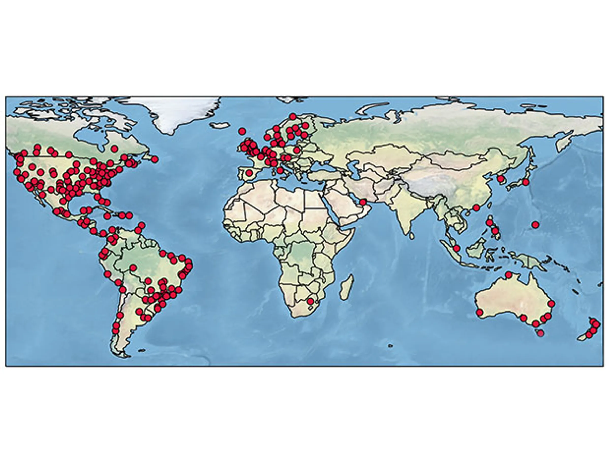
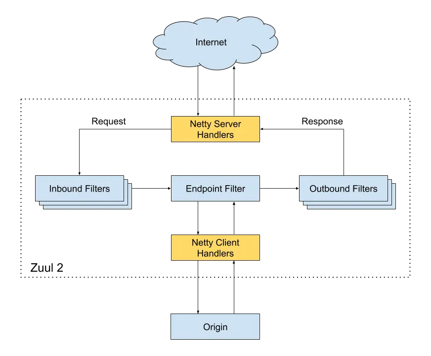
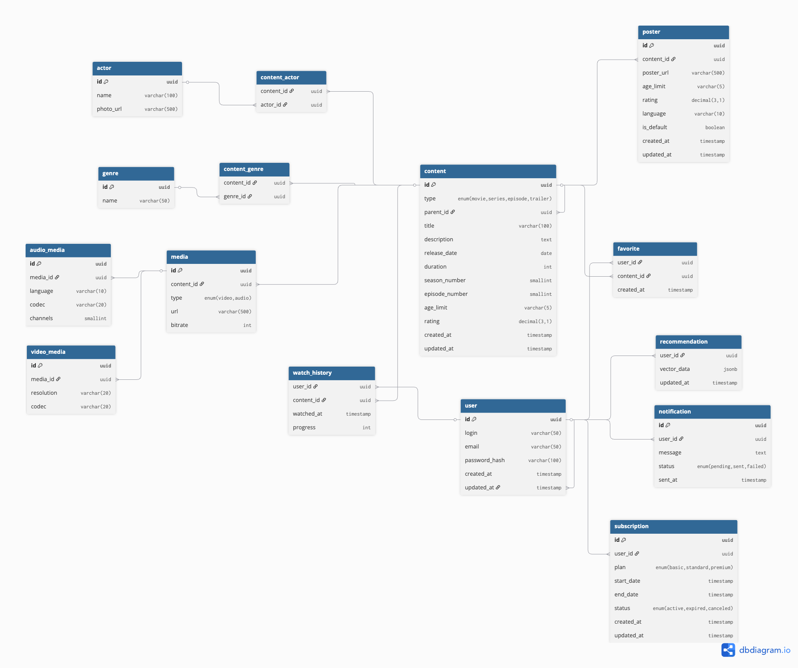

# Проектирование высоконагруженных систем
## 1. Тема и целевая аудитория
**Netflix** — крупнейший в мире стриминговый сервис, предоставляющий по подписке доступ к тысячам фильмов,включая контент собственного производства.
## 2. Целевая аудитория
- География: более 190 стран по всему миру
- Аудитория: платформа насчитывает более 325 миллионов платных подписчиков по всему миру по состоянию на конец 2025 года.

- Активность и вовлеченность: 

    1) Во втором полугодии 2025 года пользователи Netflix в совокупности просмотрели 96 миллиардов часов контента
    2) Рост просмотров оригинального контента Netflix (Originals) во втором полугодии 2025 года составил 9% по сравнению с аналогичным периодом прошлого года 

## 3. Ключевой функционал
- Персонализированный каталог: подборка контента ранжированная по релевантности для конкретного пользователя
- Поиск и навигация: поиск по фильмам, сериалам, жанрам.актерам, режисеррам
- Система профилей: возможность создания нескольких профилей в рамках одной учетной записи
- Управление контентом и скачивание: добавление контента в "мой список" и возможность скачивать фильмы и сериалы для просмотра оффлайн

## Ключевые продуктовые решения
- Персонализация подбираемого контента с помощю ИИ, используются алгоритмы машинного обучения, подбираемый контент так же зависит от контекста (в какое время дня пользователь спользуется сервисом, с какого устройства)
- Собственная сеть серверов вместо публиных CDN
- Возможность создавать несколько индивидуальных профилей на один аккаунт, каждый со своими рекомендациями и настройками

## Источники
- https://ru.wikipedia.org/wiki/Netflix
- https://netflixtechblog.com/
- https://www.nielsen.com/news-center/2025/netflix-breaks-into-top-3-media-distributors-for-the-first-time-in-nielsens-june-2025-media-distributor-gauge/

# Расчет нагрузки

## Продуктовые метрики

| Показатель                     | Значение  |
|--------------------------------|-----------|
| Целевая аудитория              | 282.68 млн|
| Количество посетителей в сутки | 51.2 млн  |
| Используемые данные в час      | 3 Гб      |
| Среднее время просмотра за день| 3.2 часа  |

Источники: 
- https://tridenstechnology.com/ru/%D1%81%D1%82%D0%B0%D1%82%D0%B8%D1%81%D1%82%D0%B8%D0%BA%D0%B0-%D0%BF%D0%BE%D0%B4%D0%BF%D0%B8%D1%81%D1%87%D0%B8%D0%BA%D0%BE%D0%B2-netflix/#h-statistics-on-netflix-usage

- https://www.comparitech.com/blog/vpn-privacy/netflix-statistics-facts-figures/

| Распределение аудитории по миру   |           |
|-----------------------------------|-----------|
| Соединенные Штаты Америки         | 74.58 млн |
| Европа, Центральная Азия, Африка  | 73.73 млн |
| Латинская Америка                 | 39.61 млн |
| Азиатско-Тихоокеанский регион     | 33.72 млн |

Источник: 
- https://www.demandsage.com/netflix-subscribers/

### Рассчитаем общее количество часов просмотра в сутки:
- 51.2 млн × 3.2 ч = 163.84 млн часов/сутки
### Рассчитаем ежедневный объем видеотрафика:
- 163.84 млн ч × 3 ГБ/ч = 491.52 млн ГБ/сутки

### Оценим приблизительный вес основных страниц и элементов:

- Главная страница: 3 МБ
- Страница с поиском: 6 МБ (допустим, 6 запросов в день)
- Страница с подборками: 4 МБ
- Страница профиля: 2 МБ
- Превью фильмов: 10 МБ за штуку (загружается при наведении)

### Предположим, что каждый пользователь в день:
- Заходит на главную (1 раз) = 3 МБ
- Делает 6 поисковых запросов = 6 × 6 МБ = 36 МБ
- Смотрит подборки (1 раз) = 4 МБ
- Заходит в профиль (1 раз) = 2 МБ
- Просматривает 12 превью (наводя мышкой) = 12 × 10 МБ = 120 МБ
- Итого статики на одного пользователя в день:
3 + 36 + 4 + 2 + 120 = 165 МБ

### Общий дневной трафик статики:
51.2 млн × 165 МБ = 8 448 млн МБ/сутки

## Пиковое потребление

Для расчета пиковой нагрузки примем следующие допущения: 

- Пиковое время: 20:00–21:00 (В Европе)
- Доля пользователей в пике: 50%
- Дополнительная нагрузка от релиза: +20% 

### Итого пиковая аудитория:
51.2 млн × (0.5 + 0.2) = 51.2 млн × 0.7 = 35.84 млн пользователей

| Требуемая скорость для скачивания видео  | Мбит/с  |
|------------------------------------------|---------|
| FullHD                                   | 5-8     |
| 2K                                       | 25      |
| 4K                                       | 45      |

Для расчетов будем использовать среднюю скорость подключения в 6 Мбит/с
Общая скорость в пике:
35.84 млн × 6 Мбит/с = 215.04 млн Мбит/с

## Требуемый размер хранилища
На Netflix хранится около 36 000 часов фильмов и сериалов. Каждый час видео дублируется в среднем в 50 экземплярах для поддержки разных разрешений (FullHD, 2K, 4K), форматов аудио, частот кадров, а также включает превью и трейлеры.

С учётом исходных (FullHD ~9 ГБ/ч, 4K ~29 ГБ/ч) и всех дополнительных материалов средний объём на один час контента составляет 65 ГБ.

### Общий объём библиотеки:
36 000 ч × 65 ГБ/ч = 2 340 000 ГБ ≈ 2,34 ПБ

Данные пользователей (аккаунты, подписки, история просмотров) занимают менее 1% от объёма контента — не более 0,023 ПБ.

| Тип данных            | 	Объём (ПБ) |
|-----------------------|--------------|
|Библиотека контента	|    2,34      |
|Пользовательские данные|	< 0,023    |
|**ИТОГО**	~2,36 ПБ    |              |

## RPS
### Средний RPS:
Пиковый RPS получен исходя из пиковой аудитории 35,84 млн пользователей, каждый из которых в час пик совершает 5 запросов. Коэффициент роста от среднего к пиковому RPS составил ≈5,6.

| Наименование действия | Средний RPS | Пиковый RPS |
| --- | --- | --- |
| просмотр видео в формате FullHD | 191250 | 459000 |
| просмотр видео в формате 2K | 956250 | 229500 |
| просмотр видео в формате 4K | 382500 | 918000 |
| поисковые запросы | 2656 | 6375 |
| просмотр превью | 7438 | 17850 |
| просмотр трейлера| 1487 | 3570 |
| просмотр профиля | 903 | 2550 |

# Глобальная балансировка нагрузки

## Функциональное разбиение по доменам 
- netflix.com - основной домен
- netflix.net - домен кэширования ресурсов
- nflxvideo.net - домен доставки видео
- nflximg.com - домен доставки изображений

## Обоснование расположения ДЦ

| Регион | Местоположение ДЦ | Обоснование выбора местоположения |
| :--- | :--- | :--- |
| Северная Америка | Эшберн, Лос-Анджелес, Чикаго, Торонто, Мехико | Эшберн (Северная Вирджиния) является критической точкой обмена интернет-трафиком и хабом для множества трансатлантических кабелей. Лос-Анджелес обслуживает западное побережье и выступает шлюзом для трафика из Азии. Чикаго обеспечивает связность Центрального и Восточного побережий. Торонто и Мехико локализуют трафик, снижая нагрузку на магистральные каналы США при обслуживании канадских и мексиканских провайдеров. |
| Южная Америка | Сан-Паулу, Сантьяго | Сан-Паулу является доминирующей точкой в регионе, через которую проходит большая часть трафика Бразилии. Сантьяго выступает в качестве регионального хаба для западного побережья Южной Америки, оптимизируя маршруты для Чили и соседних стран с развитой телеком-инфраструктурой. |
| Европа | Франкфурт, Амстердам, Лондон, Париж, Стокгольм | Франкфурт и Амстердам — крупнейшие европейские точки обмена трафиком, обеспечивающие высокую плотность соединений. Лондон и Париж покрывают основные экономические центры с высокой плотностью пользователей. Стокгольм обслуживает Северные страны. |
| Азия | Токио, Сингапур, Мумбаи, Гонконг | Токио — технологический центр с одной из самых плотных сетей оптоволокна в мире. Сингапур — ключевой телекоммуникационный узел Юго-Восточной Азии (точка стыковки множества подводных кабелей). Мумбаи обслуживает быстрорастущий рынок Индии с огромным мобильным трафиком. Гонконг — исторический шлюз для трафика в Китай и другие части Восточной Азии. |
| Африка | Йоханнесбург, Найроби | Йоханнесбург является крупнейшим интернет-хабом Южной Африки с развитой подводной кабельной инфраструктурой. Найроби (Кения) выступает в роли растущего технологического центра и точки входа для трафика Восточной Африки. |
| Океания | Сидней | Сидней концентрирует основные точки обмена трафиком Австралии и является точкой выхода подводных кабелей, соединяющих континент с США и Азией. Позволяет обслуживать Австралию и Новую Зеландию без дорогостоящей переброски трафика через Тихий океан в реальном времени. |

### Расчет распределение запросов из секции "Расчет нагрузки" по типам запросов по датацентрам

## Возьмем кол-во подписчиков Netflix по странам и подсчитаем процент от общего числа пользователей

- **Северная Америка:** 81440100 + 9048900 + 13874980 + 1206520 + 452445 + 452445 + 211141 + 150815 + 150815 + 150815 + 60326 + 90489 = 108289792  

**108289792 / 30000000 ≈ 36%** 
- **Южная Америка:** 16589650 + 6334230 + 6032600 + 2413040 + 1809780 + 904890 + 452445 + 452445 + 271467 + 301630 + 60326 + 30163 = 36652666  

**36652666 / 300000000 ≈ 12.2%**
- **Европа:** 18399430 + 16589650 + 13573350 + 7842380 + 5730970 + 4222820 + 3921190 + 2413040 + 2413040 + 2262225 + 1658965 + 1598639 + 1508150 + 1357335 + 1236683 + 1206520 + 1176357 + 965216 + 935053 + 904890 + 512771 + 422282 + 331793 + 271467 + 211141 + 211141 + 211141 + 180978 + 120652 + 120652 + 60326 + 60326 + 30163 + 90489 + 60326 = 86000000  

**86000000 / 300000000 ≈ 28.6%**
- **Азия:** 12366830 + 9048900 + 8355151 + 4222820 + 2714670 + 2413040 + 2262225 + 2111410 + 1809780 + 1809780 + 1206520 + 1206520 + 301630 + 301630 + 180978 + 150815 + 60326 + 30163 = 50000000

**50_000_000 / 300000000 ≈ 16.6%**

| Наименование действия | Пиковый RPS (глобальный) | Северная Америка (36%) | Европа (28.6%) | Азия (16.6%) | Южная Америка (12.2%) | Океания (2.8%) | Африка (0.6%) |
| :--- | :--- | :--- | :--- | :--- | :--- | :--- | :--- |
| просмотр видео в формате FullHD | 459 000 | 165 240 | 131 274 | 76 194 | 55 998 | 12 852 | 2 754 |
| просмотр видео в формате 2K | 229 500 | 82 620 | 65 637 | 38 097 | 27 999 | 6 426 | 1 377 |
| просмотр видео в формате 4K | 918 000 | 330 480 | 262 548 | 152 388 | 111 996 | 25 704 | 5 508 |
| поисковые запросы | 6 375 | 2 295 | 1 823 | 1 058 | 778 | 179 | 38 |
| просмотр превью | 17 850 | 6 426 | 5 105 | 2 963 | 2 178 | 500 | 107 |
| просмотр трейлера | 3 570 | 1 285 | 1 021 | 593 | 436 | 100 | 21 |
| просмотр профиля | 2 550 | 918 | 729 | 423 | 311 | 71 | 15 |

### Схема DNS балансировкив
В Netflix используется latency-based балансировка на основе Route 53. 
Route 53 принадлежит Amazon, который имеет сервера по всему миру. Это позволяет Route 53 на основе анализа latency до большого числа ресурсов строить оптимальные маршруты для конечных пользователей Netflix.

### Схема балансировки на основе Anycast
Помимо балансировки запросов к облачной инфраструктуре (управление аккаунтами, API, логика приложения), Netflix решает задачу маршрутизации трафика к своей собственной сети доставки контента (CDN) — Open Connect. Для этого используется технология Anycast .

Anycast — это метод сетевой маршрутировки, при котором один и тот же IP-адрес анонсируется (объявляется в глобальных маршрутных таблицах) из нескольких географически распределенных точек присутствия . Когда пользователь запрашивает видео с домена nflxvideo.net, его устройство пытается установить соединение с этим IP-адресом. Интернет-маршрутизаторы, используя протокол BGP, автоматически направляют пакеты по кратчайшему (с точки зрения автономных систем, AS) пути к ближайшей точке, анонсирующей этот адрес 

- https://openconnect.netflix.com/en/peering/#internet-exchange-participation

- https://worldpopulationreview.com/country-rankings/netflix-users-by-country

- https://www.netify.ai/resources/networks/netflix

# Локальная балансировка нагрузки

## DNS балансировка

В качестве Service Discovery в Netflix используется Eureka. Eureka обеспечивает балансировку нагрузки между конечными сервиса (round-robin), а также их отказоустойчивость.
Сервисы регистрируются в Eureka, а затем отправляют удары для продления аренды каждые 30 секунд. Если клиент не может продлить аренду несколько раз, он будет удален из реестра сервера примерно через 90 секунд. Регистрационная информация и продление копируются на все узлы Eureka в кластере. Клиенты из любой зоны могут искать информацию о реестре (происходит каждые 30 секунд), чтобы найти свои услуги (которые могут находиться в любой зоне) и совершать удаленные звонки.

## L7 балансировка

Zuul 2 является центральной точкой входа для всего трафика. Используется для маршрутизации внутреннего и внешнего трафика. Netflix управляет и эксплуатирует более 80 кластеров Zuul 2, отправляя трафик примерно в 100 (и растущие) серверные сервисные кластеры, что составляет более 1 миллиона запросов в секунду.

Пусть:
- Общая нагрузка: RPS_total = 1 000 000 запросов/с.
- Один экземпляр Zuul выдерживает RPS_instance = 12 500 запросов/с (при типичной конфигурации Netflix).
- Ограничение по SSL: TLS_handshakes_per_instance = 5 000 рукопожатий/с (с учётом возобновления сеансов, Session Ticket Resumption, это число может быть выше, но нужно учитывать пики новых соединений).

Требуемое количество экземпляров без учёта резервирования:
N_rps = ceil(1 000 000 / 12 500) ≈ 80
N_tls = ceil(1 000 000 * (доля новых сессий) / 5 000)

С учётом того, что не каждый запрос требует полного handshake (благодаря session ticket), лимитирующим фактором может стать RPS. Netflix имеет 80 кластеров Zuul, в каждом ~100 экземпляров, итого ~8 000 экземпляров, что значительно превышает минимальную оценку. Это объясняется требованиями к географическому распределению, изоляции сервисов и дополнительным резервированием.

Фактор резервирования:
Для каждого кластера (например, обслуживающего конкретный сервис или регион) применяется N+1 или N*2. Если базовое расчётное количество для одного кластера = 50, то с N+1 получим 51, а с N*2 – 100. Именно 100 экземпляров на кластер и упоминается в тексте.

## Routing балансировка 
Можно предположить, что в качестве балансировщика между кластерами Zuul и экземплярами внутри кластера Zuul используется Routing балансировка, за счет выстраивания симметричной топологии сети и распределения нагрузки алгоритмом хэширования.

## SSl терминация

Zuul выступает единой точкой входа, обрабатывающей TLS/SSL для всех входящих запросов. Для всех устройств Netflix поддерживает TLS 1.3. В качестве оптимизации можно использовать Session Ticket Resumption. Сервер генерирует session ticket после первоначального рукопожатия. Этот билет включает необходимые параметры сеанса, зашифрованные с помощью специфичного для сервера ключа. Клиент сохраняет этот ticket и предъявляет его при возобновлении сеанса, чтобы быстро возобновить защищенный сеанс.

# Логическая схема БД

# База данных Netflix — описание таблиц и требования

## Сводная таблица всех таблиц

| Таблица | Поле | Тип | Описание |
|---------|------|-----|----------|
| **user** | id | uuid | Уникальный идентификатор пользователя |
| | login | varchar(50) | Логин пользователя |
| | email | varchar(50) | Email пользователя | Unique, используется для входа |
| | password_hash | varchar(100) | Хэш пароля | С солью, не хранится в открытом виде |
| | created_at | timestamp | Дата регистрации | |
| | updated_at | timestamp | Дата последнего обновления профиля | |
| **subscription** | id | uuid | Уникальный идентификатор подписки | PK |
| | user_id | uuid | Ссылка на пользователя | FK → user.id |
| | plan | enum | Тарифный план: basic, standard, premium | Определяет качество видео и количество экранов |
| | start_date | timestamp | Начало действия подписки | |
| | end_date | timestamp | Окончание действия подписки | |
| | status | enum | Статус: active, expired, canceled | |
| | created_at | timestamp | Дата создания записи | |
| | updated_at | timestamp | Дата последнего обновления | |
| **content** | id | uuid | Уникальный идентификатор контента | PK |
| | type | enum | Тип контента: movie, series, episode, trailer | |
| | parent_id | uuid | Ссылка на родительский контент | Для episode → series, для trailer → movie/series, FK → content.id |
| | title | varchar(100) | Название | |
| | description | text | Описание | |
| | release_date | date | Дата выхода | |
| | duration | int | Длительность в минутах | Для фильмов и эпизодов |
| | season_number | smallint | Номер сезона | Только для эпизодов |
| | episode_number | smallint | Номер эпизода в сезоне | Только для эпизодов |
| | age_limit | varchar(5) | Возрастное ограничение | Например, "16+" |
| | rating | decimal(3,1) | Средняя оценка | От 0 до 10 |
| | created_at | timestamp | Дата создания записи | |
| | updated_at | timestamp | Дата последнего обновления | |
| **genre** | id | uuid | Уникальный идентификатор жанра | PK |
| | name | varchar(50) | Название жанра | Например, "Комедия", "Драма" |
| **content_genre** | content_id | uuid | Ссылка на контент | FK → content.id |
| | genre_id | uuid | Ссылка на жанр | FK → genre.id |
| **actor** | id | uuid | Уникальный идентификатор актёра | PK |
| | name | varchar(100) | Имя актёра | |
| | photo_url | varchar(500) | Ссылка на фото актёра | Хранится в S3 |
| **content_actor** | content_id | uuid | Ссылка на контент | FK → content.id |
| | actor_id | uuid | Ссылка на актёра | FK → actor.id |
| **poster** | id | uuid | Уникальный идентификатор постера | PK |
| | content_id | uuid | Ссылка на контент | FK → content.id |
| | poster_url | varchar(500) | Ссылка на изображение постера | Хранится в S3 |
| | age_limit | varchar(5) | Возрастное ограничение для этого постера | Может отличаться для разных регионов |
| | rating | decimal(3,1) | Рейтинг для этого постера | Может отличаться для разных регионов |
| | language | varchar(10) | Язык постера | Для мультиязычных версий |
| | is_default | boolean | Основной постер для данного языка | |
| | created_at | timestamp | Дата создания записи | |
| | updated_at | timestamp | Дата последнего обновления | |
| **media** | id | uuid | Уникальный идентификатор медиафайла | PK |
| | content_id | uuid | Ссылка на контент | FK → content.id |
| | type | enum | Тип медиа: video, audio | |
| | url | varchar(500) | Ссылка на файл в S3 | |
| | bitrate | int | Битрейт в кбит/с | |
| **video_media** | id | uuid | Уникальный идентификатор видео-детали | PK |
| | media_id | uuid | Ссылка на медиафайл | FK → media.id |
| | resolution | varchar(20) | Разрешение видео: Low, HD, Ultra HD и т.д. | |
| | codec | varchar(20) | Кодек видео | H.264, VP9 и др. |
| **audio_media** | id | uuid | Уникальный идентификатор аудио-детали | PK |
| | media_id | uuid | Ссылка на медиафайл | FK → media.id |
| | language | varchar(10) | Язык аудиодорожки | |
| | codec | varchar(20) | Кодек аудио | AAC, MP3 и др. |
| | channels | smallint | Количество каналов | 2 (стерео), 6 (5.1) и т.д. |
| **favorite** | user_id | uuid | Ссылка на пользователя | FK → user.id, составной PK |
| | content_id | uuid | Ссылка на контент | FK → content.id, составной PK |
| | created_at | timestamp | Дата добавления в избранное | |
| **watch_history** | user_id | uuid | Ссылка на пользователя | FK → user.id, составной PK |
| | content_id | uuid | Ссылка на контент | FK → content.id, составной PK |
| | watched_at | timestamp | Дата и время начала просмотра | |
| | progress | int | Количество просмотренных секунд | Для возобновления просмотра |
| **recommendation** | user_id | uuid | Ссылка на пользователя | PK |
| | vector_data | jsonb | Векторные данные для рекомендаций | Эмбеддинги или список рекомендованных id |
| | updated_at | timestamp | Дата последнего обновления рекомендаций | |
| **notification** | id | uuid | Уникальный идентификатор уведомления | PK |
| | user_id | uuid | Ссылка на пользователя | FK → user.id |
| | message | text | Текст уведомления | |
| | status | enum | Статус доставки: pending, sent, failed | |
| | sent_at | timestamp | Дата и время отправки | |

---

**Файловые данные** (S3, облачное хранилище):
- Постеры: ~20 млн × 0.5 МБ = ~10 ТБ
- Видео/аудио файлы: десятки петабайт (все варианты качества, языки, сегменты). Фактически Netflix хранит сотни петабайт видеоконтента.

---

### Нагрузка (QPS) на чтение/запись

| Операция | Чтение (QPS) | Запись (QPS) | Примечания |
|----------|--------------|--------------|------------|
| Авторизация (user) | 500 000 | 1 000 | Проверка подписки и логина |
| Получение метаданных контента (content, poster, genre, actors) | 2 000 000 | 10 000 | Главная страница, поиск, страница деталей |
| Запрос медиафайлов (media) | 10 000 000 | 50 000 | Стриминг видео/аудио — самый высокий RPS |
| История просмотров (watch_history) | 500 000 (чтение прогресса) | 2 000 000 (запись прогресса каждые несколько секунд) | Интенсивная запись |
| Избранное (favorite) | 200 000 | 10 000 | |
| Рекомендации (recommendation) | 1 000 000 | 1 000 (периодическое обновление) | Чтение при каждом сеансе |
| Уведомления (notification) | 100 000 | 10 000 | |

**Суммарно**:
- Пиковое чтение: до 10–15 млн QPS.
- Пиковая запись: до 2–3 млн QPS.

---

### Требования к консистентности

| Таблица / операция | Требование | Обоснование |
|--------------------|------------|-------------|
| **user, subscription** | Сильная консистентность (strong) | Платежи, доступ к контенту — критично. После обновления подписки пользователь должен сразу получить доступ. |
| **content, poster, genre, actor** | Слабая консистентность (eventual) | Метаданные обновляются редко, допустима задержка до нескольких минут. Используется кэширование. |
| **media (видеофайлы)** | Сильная консистентность для сегментов, доступных пользователю | При загрузке нового контента важно, чтобы все сегменты стали доступны одновременно, но допустима небольшая задержка (минуты). |
| **watch_history** | Слабая консистентность (eventual) | Прогресс просмотра может слегка запаздывать. Приоритет — низкая задержка записи. |
| **favorite** | Сильная консистентность (strong) | Пользователь ожидает мгновенного отображения добавленного в избранное. |
| **recommendation** | Слабая консистентность (eventual) | Рекомендации обновляются раз в несколько часов, допустима задержка. |
| **notification** | Слабая консистентность (eventual) | Уведомления могут приходить с небольшой задержкой. |

---

### Особенности распределения нагрузки по ключам

| Таблица / ключ | Стратегия распределения | Обоснование |
|----------------|-------------------------|-------------|
| **user.id** | Шардирование по user_id (хэш) | Все операции пользователя (подписка, история, избранное) лучше выполнять на одном шарде для уменьшения сетевых вызовов. |
| **subscription** | Вместе с user (колокация) | Следует за user.id, обычно хранится на том же шарде. |
| **content.id** | Шардирование по content_id (хэш) | Метаданные равномерно распределяются. |
| **watch_history** | Шардирование по user_id | Вся история просмотров одного пользователя на одном шарде — важно для быстрой загрузки прогресса и обновлений. |
| **favorite** | Шардирование по user_id | Аналогично watch_history. |
| **recommendation** | Шардирование по user_id | Рекомендации для пользователя на одном шарде. |
| **notification** | Шардирование по user_id | Уведомления для пользователя на одном шарде. |
| **media, video_media, audio_media** | Шардирование по content_id | Все файлы одного контента желательно размещать в одном месте для эффективной стриминговой доставки. Часто используется комбинация с географической привязкой (региональные копии). |
| **content_genre, content_actor** | Шардирование по content_id | Для быстрого получения жанров и актёров конкретного контента. |

**Географическое распределение**:
- Метаданные (content, poster) реплицируются во все регионы.
- Медиафайлы размещаются в регионах на основе популярности контента и сетевой топологии (CDN).
- Пользовательские данные (watch_history, favorite) хранятся в регионе проживания пользователя.

**Кэширование**:
- Redis используется для кэширования метаданных, сессий пользователей, рекомендаций (TTL от минут до часов).
- Для медиафайлов используется CDN с кэшированием на краевых узлах.

---